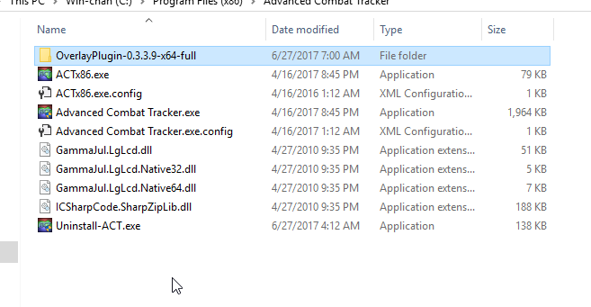
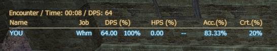
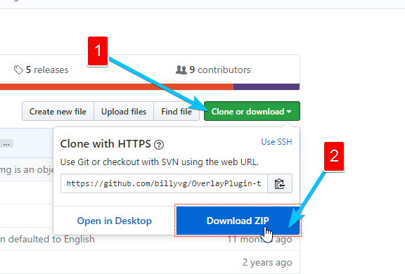
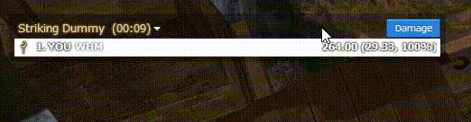
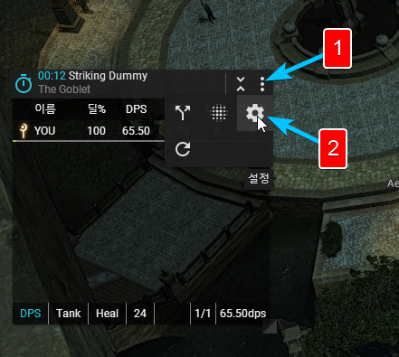
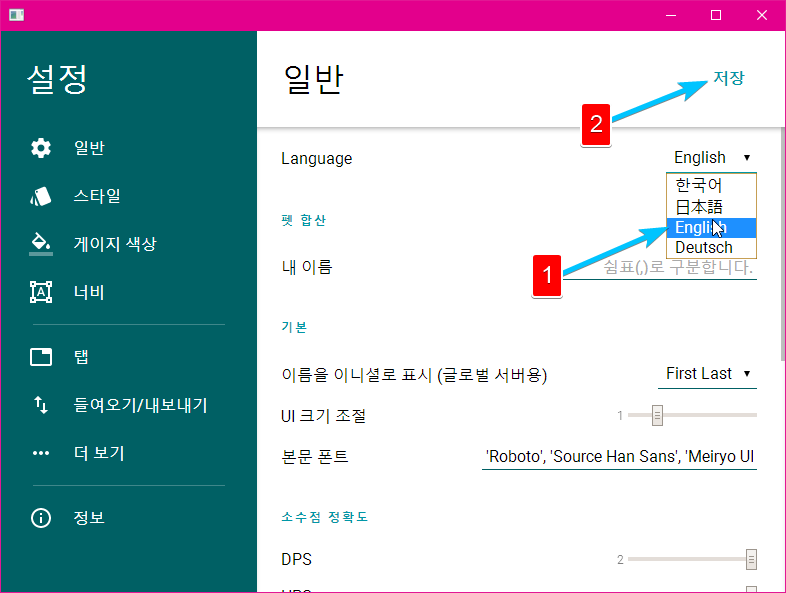
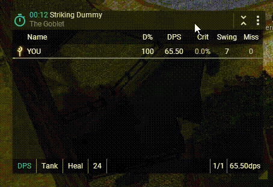
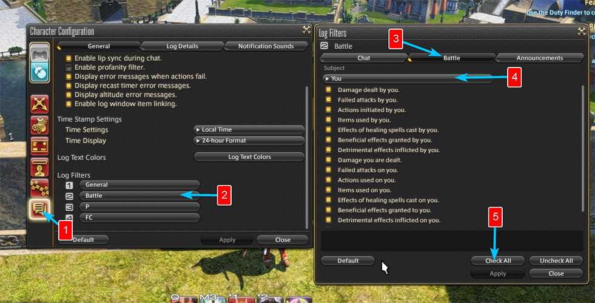
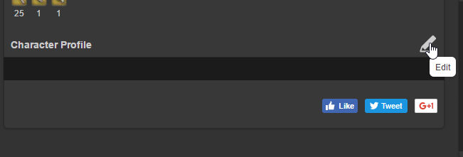

## Introduction
Welcome to our guide on how to install and track your DPS using Advanced Combat Tracker, or commonly known as ACT. If you are coming from World of Warcraft or you simply are a new player to Final Fantasy 14 and have wondered "How do I track my DPS" or "Is there a DPS/HPS/etc Addon for FFXIV" this guide will answer these questions. Short answer is: Yes, there is a way to track and parse your performance during your game sessions, but only on PC, not on consoles.

### What this guide will cover?
**TIP: If you click on any of the following sub-points, your page will scroll down to it.**
* [What is ACT](http://fellcleave.com/home/advanced-combat-tracker-dps-meter#what-is-act)
* [How to Install ACT](http://fellcleave.com/home/advanced-combat-tracker-dps-meter#how-to-install-act)
* [How to Install, Use and Customize Overlays](http://fellcleave.com/home/advanced-combat-tracker-dps-meter#act-overlay)
* [Setup Recommendations for ACT](http://fellcleave.com/home/advanced-combat-tracker-dps-meter#recommended-act-setup)
* [How to upload Logs to FFLogs.com](http://fellcleave.com/home/advanced-combat-tracker-dps-meter#fflogs-setup)

Should you encounter any problems with this guide, you can use the comment section below to let us know about any of the errors or changes that we might have overlooked. But before we delve to deep into the "_ins and outs_" lets us cover one important question.

### Is it against the Terms of Service to use 3rd party software? 
**Short answer**: Yes, it is!  
**Long Answer**:  It's grey area and it depends on you and how you use it but in general Square will not take actions against you as long as you don't make it a problem. If you install ACT (from now on (incorrectly) referred as the DPS meter in this guide) for you to improve your gameplay and to check for ways that you can better use your CDs or if you are a tank for example to check the last few seconds before a death, then there will be no issues. There are a lot of streamers that use it and show it on stream and even more boss kills videos on youtube then we can count, featuring a DPS meter overlay, so should you use it? You can use the DPS meter for your own needs, not to harass people and their performance during an/after encounter. A good rule of thumb is do not post DPS breakdowns in any of the chat channels available in-game, just to be safe. 
But won't that defeat the reason of installing such an addon? Well not really, let's say you have a player that underperforms, badly, what can you do about it? Pull up the logs and see what he does wrong but instead of saying "You only do XXXX DPS because X/Y/Z" you could say "I have noticed you are not using your cooldowns in the most efficient way, using them like this .... should be far more effective" and just like that, not only that you get the benefits of having a DPS parser, but you also just helped someone improve their gameplay!

Of course, this is a very basic and general example, the use of ACT is much much broader. We will talk about some of it's features and how they can be implemented below in this guide.

## What is Advanced Combat Tracker (ACT)
In its most basic form ACT is a tool that reads and parses your combat logs and outputs relevant data for Damage, Healing, Crit rate, Enmity and so on. With the work of Ravahn ( http://www.reddit.com/user/Ravahn ) ACT has also been brought to FFXIV, initially ACT was created for EverQuest 2 but with the help of other developers the tool has been adapted to many other MMOs with the use of plugins.

 

## How to install ACT
1) To install ACT simply go to their official download page found here [http://advancedcombattracker.com/download.php](http://advancedcombattracker.com/download.php) and download either the Setup or ZIP archive. 
Run the installation and when finished click on the Close button.  
Right now you should have the Advanced Combat Tracker icon on your desktop   

2) Launch the tool with Administrator rights or else you will encounter problems later. When you first launch you should see the "First Run" Wizard. Click on Next.  

3) On the "Parsing Plugin" tab first click on "**Get available parsing plugins**" and wait a few seconds. Once **(66) FFXIV Parsing Plugin** appears on the drop-down menu click on it (should be selected by default) then click on "**Use this plugin**". A confirmation window will let you know once the plugin installation is finished.  
    
 

4) Click "Next" a pop-up window will ask you "Will ACT be used for EverQuest II?" click on "**No**" then you will be asked to manually choose your log. 
5) You log will be (usually) in a path that looks like this: "\Documents\My Games\FINAL FANTASY XIV - A Realm Reborn\FFXIV_CHRXXXXXXXXXXXXXXX\log" and select the first file. If you DON'T have a log folder and/or text files in it. [READ HERE](http://fellcleave.com/home/advanced-combat-tracker-dps-meter#problems) 
Make sure "Auto-load recently changed log files" is selected  

6) On the **Startup Settings** tab make sure that "Attempt to split the log file" set to **0** (by default it's set to 64mb)  

7) Once that was done, you can click the "**Close**".
8) Last step is to add ACT to your Firewall bypass protocol. You can do that by typing "Firewall" in your start menu and launch Windows Firewall.  
Click on "**Allow an app or feature through Windows Firewall**"

The most basic installation of ACT is now complete, to test it out login on your character and hit a few monsters or the training dummy. If you see something like in the image below you did everything right and you ready to move to the next step and make the Overlay look pretty! 

 

## How to Install, Use and Customize Overlays
### OverlayPlugin.DLL Installation
You can install overlays and display data, such as DPS, without the need to ALT+TAB back to ACT every time you want to get a quick glance at what's happening, with the help of a plugin called "OverlayPlugin" which can be downloaded following this link [https://github.com/RainbowMage/OverlayPlugin/releases](https://github.com/RainbowMage/OverlayPlugin/releases)  
Choose the correct type x64 for 64BIT PCs and x86 for 32BIT PCs and download the archive on your PC.

1) Extract the folder into the Advanced Combat Tracker folder (usually in program files, by default). You can rename the folder to anything you wish. 

2) Click on the "**Plugins**" Tab (denoted with 1 in the image below). Then click "**Browse**" (denoted with 2 in the image below) and go inside the ACT -> The Overlay folder and choose "OverlayPlugin.dll". It's very important that you choose the OverlayPlugin.dll and not OverlayPlugin.Core.dll or other .DLL file! Then click on "**Add/Enable Plugin**" (denoted with 3 in the image below). To make sure the plugin is enabled, check point 4 in the image below and see if there is a checkmark on "Enabled". If there is, you are done! Overlay Plugin iinstallation is complete!  

You can test if it functions correctly as the Overlay should be already available! You can move the overlay in to a position that you want by simply dragging it. 

### Usage of OverlayPlugin.DLL
This plugin is great for a lot of reasons! You can basically pull any information you wish to display and code it with HTML/CSS!  
For now let's look at the main options this plugin has to offer and see how we can work with them. 

Click on "**Plugins**" and then on "OverlayPlugin.dll" Tab (not to be confused with FFXIV Overlay Plugin tab).  
The "General" doesn't hold any options that we care about so move to Mini Parse or Spell Timer Tabs. Here you can choose to Show or Hide the select overlay, enable clickthru or lock the overlay in a position.  
Keep in mind, if you enable Clickthru and later choose an overlay that has buttons or different tabs (which you can click), you won't be able to click on them. For example a few overlay themes (that we will cover below) have buttons to change from DPS view to Healing view and so on. Having Clickthru enabled will stop you from clicking the button.

We also recommend you to "**Enable global hotkey** and assign a hotkey for it so you can quickly Show or Hide the overlay during gameplay sessions, without the need of alt+tabbing to ACT and manually Show or Hide the overlay.

### How to Customize and add more Themes to the Overlay
There are a ton of overlays from which you can choose. Some basic and some really advanced! Some even come with a "End Encounter" function that is really useful when you are in a dungeon (for example) and you need access to quick "End Encounter".   
You can download them following this link [https://github.com/billyvg/OverlayPlugin-themes](https://github.com/billyvg/OverlayPlugin-themes) and clicking on the green "Clone or Download" button.  

Once you have the archive, extract it to: /ACT-FOLDER/OverlayPlugin-Folder/resources/ 

1) To change the theme (or look) of the default overlay, go to the main ACT window, click on "Plugins" then "OverlayPlugin.DLL" and click on the MiniParser. 
2) Click on the "..." button at the right side of "URL" and go to the resources folder (where you extracted the themes/overlays) 

Choosing the rdmty_default.html  file will give you this theme. Explore and see which one you like the most or read below to see how to download and install the Overlay/Theme that we recommend!  

### Kagerou - Why is it one of the best overlays?
Kagerou, Pronounced as /ka-ge-row/ (not j-like g), is over of the most advanced overlays that you can get your hands on. This awesome overlay has been developed by Hibiyasleep ( https://github.com/hibiyasleep ).

1) Go to **ACT Main Window** -> Click on "**Plugins**" and Disable the Mini Parse and Spell Timers unchecking the "Show Overlay". 
2) Click on "General" tab inside the "OverlayPlugin.dll" master tab and then click on "**New**" Insert a name select Mini Parse and click "**Okay**".  

3) You now should have a **new** tab with the name that you choose. Click on it where it asks for URL add: https://hibiyasleep.github.io/kagerou/overlay  

If you did everything correctly, you should have a new overlay... But it's in Korean!?!?! How do we Fix this?  
Easy! Click on the ":" at the upper right corner on the overlay (remember, if nothing happens, check if you have Clickthru enabled or not) then click on the cogwheel to open the settings page.  

On the Settings page, click on the drop-down menu to the right of "Languages" (denoted with 1 in the image below) select your preferred language then click "Save" (denoted with 2 in the image below)  

Now go back to the Advanced Combat Tracker, make sure you are on the new tab that you just created (in this example, called Akhlis) and click "Reload Overlay"  

And you are done! This will make the overlay respond to your clicks and be in your selected language (in this case English). The result should be something like this:  

 

## Setup Recommendations for ACT
To make sure the the Advanced Combat Tracker is functioning optimal, we have a few settings to change, this list is very important to follow if you plan to use http://fflogs.com

1) Login in game and go to "**Character Configuration**" (by pressing "K" or "ESC"). Click on the "**Log Window Settings**" then scroll down and click on "**Battle**". A new window will pop-up where you will need to click on "**Battle**" and using the drop down menu (denoted with 4 in the image below) "**Check All**" and "**Apply**" (on each tab) the following options:

* You
* Party Member
* Alliance Member
* Engaged Enemy
* Unengaged Enemy
* Friendly NPCs
* Pet/Companions
* Pet/Companions (Party)
* Pet/Companions (Alliance)
* MAKE SURE THAT Other PC and Pet/Companions (Other PC) are all Unchecked! 

2) Open ACT and click on the "**Option**" tab. On the left side, under Main Table/Encounters click on General and Change "Main Table update frequency in seconds" to 1 and "Number of Seconds to wait after the last combat action to begin a new encounter" to 30.  

3) Still in the "**Option**" tab, scroll down to Output Display and click on "Mini Parse Window" and change the Update Interval to **1 second**.  

4) In the main ACT window click on "Plugins" then on "FFXIV Settings" and make sure "**Combine Pets with Owner**" and "**Simulate Individual DoT Crits**" are checked. While you are here, make sure "Disable Parsing from Network Data" **is not checked** or else your logs will be marked as invalid by fflogs.com  

5) One more option you should change is the place where ACT will store/save your logs. This step is optional but **highly recommended** as it can cause headaches later on when we connect the FFLog uploader to your ACT logs. Go to "Plugins" then on "FFXIV Settings" then click on "**Change**" and choose an easy to access path, such as **C:/fflogs** This folder will be used from now on to store logs/parses by Act.  

 

## How to upload Logs to FFLogs.com
You have done everything, installation, customization and basic settings and you are able to see your DPS/HPS, but how do you compare to other people? For that we will use http://fflogs.com to upload and rank our parses. This is an easy step and should not take you too long.

1) Head to [https://www.fflogs.com/accounts/newuser](https://www.fflogs.com/accounts/newuser) and register a new account. Once you fill in the form **don't forget** to check the email you just received and active your new account!

2) Login into your account and go back to the fflogs.com homepage. Scroll down a little and you will see a dark box that says "Lodestone Integration" click on the link and start the linking process. Copy the import code then head to your character's lodestone profile page. Once on it, scroll down and click Edit, paste the import code then click twice on the Confirmation button! Head back to FFlogs.com and click "**Import**". Your character should be on FFLogs now. 

3) Now that we have our character on FFLogs, we need to install the Client which will upload the logs for us. Head to [https://www.fflogs.com/reports/upload](https://www.fflogs.com/reports/upload) and follow the instructions there. **VERY IMPORTANT** that you install Adobe Air, or else the uploader will **not work**.

4) Launch the FF Logs Uploader, update if needed, then login. On your first run the client will ask you to Choose the log file you want to upload. If you didn't follow the recommendation above (Point 5 at Setup Recommendations for ACT) you will find your logs by default at the following path: "C:\Users\YOUR-PC-USERNAME\AppData\Roaming\Advanced Combat Tracker\FFXIV Logs\

5) Enter a description, choose if you want the log to be under a FC name or personal then make it Public or Private, click Go then let the uploader do its job!

If you followed all the instructions in this guide you now should have your first log up on FFLogs.com! 

Thank you for reading our guide, we hope we touched all the questions you might had, if not simply let us know in the comment section below or on [our discord server](https://discord.gg/YqzHYBC).